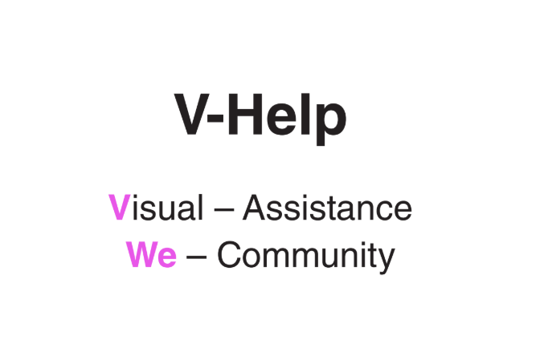

# Hackharvard2019
## Inspiration
In modern society, people tend to be atomized into individual dots, keeping polite distance from others. Visually impaired people, whose mobility and possible activities are inevitablly restricted. However, there are volunteers who are motivated to help them live a normal life just as are, by offering their help both over the internet and in person. We are creating a platform connecting atomized individuals, helping visually impeded people live up to their independent lives with dignity. 

## What it does

Vhelp is a non-profit organization with a large cohert of visually impeded users and volunteers willing to offer assistance in their spare time. Vhelp currently needs a proprietary platform for visually impaired people to seek assistance from nearby volunteers. Volunteers can either call in via the camera at the user's hand, or come in person depending on the concrete situations, to solve various problems run into by users.

## Challenges we ran into
- Andriod app development, for both user and volunteers, possibly need to be able to support IOT devices and wearable devices
- Visually impaired users interact with mobile apps differently, we need voice input and recognition backends
- For in-person assist request, we need an algorithm to fetch the best match volunteer in terms of the nearest volunteer that can reach the user, and provide navigation services to him/her 
- Get GPS positions of users and match volunteers to users
- Providing navigation for volunteers to commute to the user's place

## The tech stack under development
-  We use Andriod Studio to develop and test mobile apps.
-  We used Andriod position services API to grab real-time precise position data of the users and volunteers 
-  We used Google speech-to-text API to tackle Audio input problem
-  Used firebase to receive updates of user positions, for the Google Cloud backend to perform matching later on
-  Provide navigation service to volunteers, facilitate them finding the users
-  Use real-time sentiment analysis to monitor potential risks

Converting oral instructions of visually impeded users' into text for better communication 

## What we learned
- [x] Andriod Studio
- [x] Google Cloud APIs: speech-to-text API, text-to-speech API, sentiment analysis API etc.
- [x] Google App Engine
- [x] Firebase
- [x] Andriod positioning service

## What's next for my proj
- complete MVP and put to alpha test
